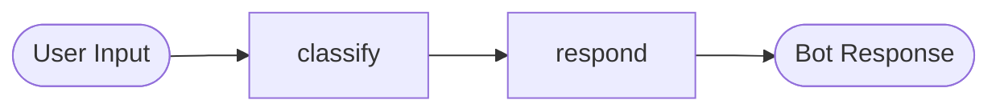

# Gemini LangGraph Chatbot

A conversational chatbot built with **LangGraph** and the **Google Gemini API**. Each user message flows through a small graph: it is first **classified** (greeting or general question) and then **routed to a response step**, which either replies instantly or calls Gemini for an answer.

This is a foundation project for exploring graph-based LLM orchestration, and a stepping stone toward a full RAG (Retrieval-Augmented Generation) system.

---

## Features

- Graph-based conversation flow using LangGraph's `StateGraph`
- Typed shared state (`question`, `classification`, `response`) using `TypedDict`
- Keyword-based intent classification (greeting vs. search/question)
- Gemini (`gemini-2.5-flash`) answers general questions via the `google-genai` SDK
- Graceful error handling around API calls
- Secure API key handling (no hardcoded secrets)
- Interactive command-line chat loop with `exit` / `quit` support
- Workflow visualization with NetworkX and Matplotlib

---

## Architecture

The graph has two nodes connected in sequence:



| Node | Responsibility |
|------|----------------|
| `classify` | Reads `question`, lowercases it, and sets `classification` to `greetings` or `search` based on keywords |
| `respond` | If `greetings`, returns a fixed welcome message. If `search`, calls Gemini and stores the answer in `response` |

**Shared state:**

```python
class GraphState(TypedDict):
    question: Optional[str]
    classification: Optional[str]
    response: Optional[str]
```

---

## Tech Stack

- **Python 3.10+**
- **LangGraph**: graph orchestration
- **Google Gen AI SDK (`google-genai`)**: Gemini API client
- **python-dotenv**: environment variable loading (local runs)
- **NetworkX + Matplotlib**: workflow visualization
- **Google Colab / VS Code**: development environments

---

## Setup

### 1. Clone the repository

```bash
git clone https://github.com/KratosArc/gemini-langgraph-chatbot.git
cd gemini-langgraph-chatbot
```

### 2. Install dependencies

```bash
pip install -r requirements.txt
```

Or install manually:

```bash
pip install langgraph google-genai python-dotenv networkx matplotlib
```

### 3. Get a Gemini API key

Create a free key at [Google AI Studio](https://aistudio.google.com/apikey).

### 4. Add your API key

**Option A: Local (VS Code / terminal)**

Create a `.env` file in the project root:

```
GEMINI_API_KEY=your_api_key_here
```

Then load it in code:

```python
import os
from dotenv import load_dotenv
from google import genai

load_dotenv()
client = genai.Client(api_key=os.environ.get("GEMINI_API_KEY"))
```

**Option B: Google Colab**

Open the **Secrets** panel (key icon in the left sidebar), add a secret named `GEMINI_API_KEY`, and enable notebook access. Then:

```python
from google.colab import userdata
from google import genai

client = genai.Client(api_key=userdata.get("GEMINI_API_KEY"))
```

> **Never commit your API key.** The `.env` file is listed in `.gitignore`.

### 5. Run the chatbot

Run the notebook cells top to bottom (or your Python script). You will see:

```
=== Gemini-Powered Chatbot ===
Type your question below. Type 'exit' to quit.
```

---

## Example

```
You: hello
Bot: Hello! What's on Your Mind Today!

You: <any general question>
Bot: <Gemini's answer>

You: exit
Bot: Goodbye!
```

<!-- Add a screenshot of your chatbot or workflow graph here:

-->

---

## Project Structure

```
gemini-langgraph-chatbot/
├── chatbot.ipynb        # Main notebook (graph, nodes, chat loop)
├── requirements.txt     # Python dependencies
├── .gitignore           # Excludes .env and cache files
└── README.md
```

---

## Roadmap

- [X] Replace the liner edge with **conditional edges** for real branching between nodes
- [ ] Add **conversation memory** so the bot remembers earlier turns
- [ ] Add a **tool-calling node** (for example a calculator)
- [ ] Add a Streamlit web UI
- [ ] Extend into a full **RAG pipeline** with a vector database

---

## Author

**Jiveshwar Singh Rathore**
GitHub: [@KratosArc](https://github.com/KratosArc) | LinkedIn: [@jiveshwarrathore](https://www.linkedin.com/in/jiveshwarrathore)

---

## License

This project is open source and available under the [MIT License](LICENSE).
